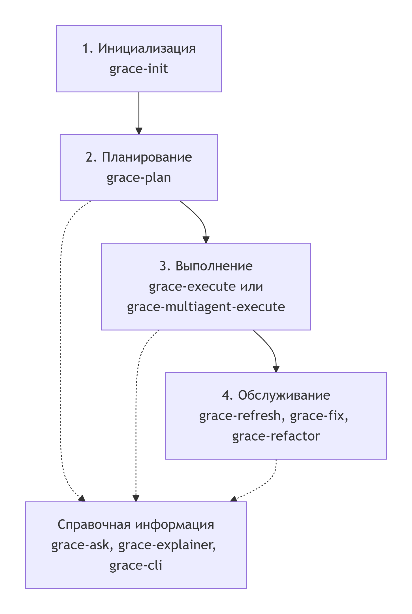

# GRACE Skills
Репозиторий содержит коллекцию навыков (skills) для проекта **GRACE** — системы, построенной на принципах агентного подхода и управления знаниями. Каждый навык представляет собой автономный модуль, предназначенный для выполнения конкретной задачи: ответа на вопросы, планирования, рефакторинга, выполнения команд и т.д.

## Структура
Все навыки находятся в директории [`skills/`](skills/) и имеют префикс `grace-`:

Каждый навык содержит:
- **`SKILL.md`** — описание назначения, процесса работы, входных и выходных данных.
- **`agents/`** (опционально) — файлы, определяющие поведение агентов для данного навыка.

## Назначение навыков
|   Навык     | Описание |
|------------ |----------|
| `grace-ask` | Отвечает на вопросы о кодовой базе, архитектуре, модулях и реализации проекта на основе полного контекста (граф знаний, артефакты, контракты)[reference:0]. |
| `grace-cli` | Взаимодействует с проектом через командную строку. |
| `grace-execute` | Выполняет заданные действия или команды. |
| `grace-explainer` | Предоставляет пояснения по коду, архитектуре или процессам. |
| `grace-fix` | Автоматически исправляет выявленные ошибки или несоответствия. |
| `grace-init` | Инициализирует новый проект, модуль или среду. |
| `grace-multiagent-execute` | Координирует выполнение задач в мультиагентной среде. |
| `grace-plan` | Разрабатывает план работ, этапы и зависимости. |
| `grace-refactor` | Проводит рефакторинг кода с сохранением функциональности. |
| `grace-refresh` | Обновляет артефакты проекта (граф знаний, контракты, документацию). |

## Использование
Каждый навык может быть вызван как самостоятельный модуль. Для работы с навыком:

1. Перейдите в директорию соответствующего навыка.
2. Ознакомьтесь с `SKILL.md` — там описан процесс, необходимые файлы и ожидаемые результаты.
3. При необходимости используйте CLI-утилиту `grace` для поиска модулей, получения контрактов и проверки артефактов[reference:1].

Это не просто набор инструментов, а строгий процесс, который обеспечивает управляемую разработку кода с участием ИИ. Основная идея в том, чтобы сначала создать архитектурный план и контракты, и только потом приступать к написанию кода.

Пошаговый план, как использовать эти навыки в правильном порядке 

Общий рабочий процесс (Pipeline)

Процесс следует принципу "сверху вниз": Требования → Технологии → План разработки → План верификации → Контракты модулей → Код и тесты.

**Весь процесс можно разбить на пять основных этапов:**

**Шаг 1: Инициализация проекта (grace-init)**
Это самый первый шаг для нового проекта. Навык создает всю необходимую структуру и шаблоны документов GRACE.

Что делает: Создает директорию docs/ и файлы-шаблоны: requirements.xml, technology.xml, development-plan.xml, verification-plan.xml, knowledge-graph.xml, operational-packets.xml, а также AGENTS.md в корне проекта.

Как использовать: Запустите навык и ответьте на вопросы о вашем проекте: название, язык программирования, ключевые библиотеки, критически важные сценарии и т.д..

Результат: Готовые шаблоны для заполнения. Следующий шаг — запустить grace-plan.

**Шаг 2: Планирование архитектуры (grace-plan)**
На этом этапе вы проектируете архитектуру вашего приложения на основе требований и технологий.

Что делает: Анализирует requirements.xml и technology.xml, чтобы разбить проект на модули. Для каждого модуля определяет его тип, назначение, зависимости (контракты) и то, как он будет верифицироваться.

Как использовать: Запустите после того, как у вас есть заполненные requirements.xml и technology.xml.

Результат: Создаются или обновляются ключевые артефакты: development-plan.xml (план разработки), verification-plan.xml (план верификации) и knowledge-graph.xml (граф знаний модулей).

**Шаг 3: Выполнение разработки (grace-execute или grace-multiagent-execute)**
Теперь, когда план готов, можно приступать к написанию кода. У вас есть два варианта:

grace-execute: Последовательное выполнение. Идеально, когда модули зависят друг от друга или есть высокие риски. Каждый шаг выполняется по порядку, с проверками и коммитами. Это более безопасный, но медленный подход.

grace-multiagent-execute: Параллельное выполнение. Подходит для больших, зрелых проектов с сильной модульной структурой и надежными тестами. Позволяет выполнять несколько модулей параллельно, что ускоряет работу. У него есть профили безопасности: safe (безопасный), balanced (сбалансированный, по умолчанию) и fast (быстрый).

Как использовать: Убедитесь, что development-plan.xml и knowledge-graph.xml существуют. Затем запустите один из навыков выполнения.

Результат: Написанный код, модульные тесты и обновленные артефакты.

**Шаг 4: Обслуживание и синхронизация**
В процессе разработки код и планы могут расходиться. Для этого есть специальные навыки.

grace-refresh: Синхронизация. Сверяет фактические артефакты (код, тесты) с планами (knowledge-graph.xml, verification-plan.xml) и сообщает о расхождениях. Бывает двух режимов: targeted (для точечных изменений) и full (полная проверка).

grace-fix: Исправление ошибок. Помогает отлаживать код, используя семантическую навигацию GRACE. Находит нужный модуль и блок кода по описанию ошибки или логам, анализирует контракт и применяет точечное исправление.

grace-refactor: Рефакторинг. Безопасно переименовывает, перемещает, разделяет или объединяет модули, автоматически синхронизируя все связанные артефакты (код, тесты, граф знаний, планы).

**Вспомогательные навыки**
Эти навыки можно использовать на любом этапе для получения информации.

grace-ask: Задайте вопрос о проекте (архитектура, код, модули), и навык найдет ответ, проанализировав все артефакты GRACE.

grace-explainer: Полное руководство по методологии GRACE. Используйте для изучения принципов, семантической разметки, контрактов и т.д..

grace-cli: Работа с утилитой командной строки grace. Позволяет быстро искать модули, проверять целостность артефактов, смотреть статус проекта и многое другое.
